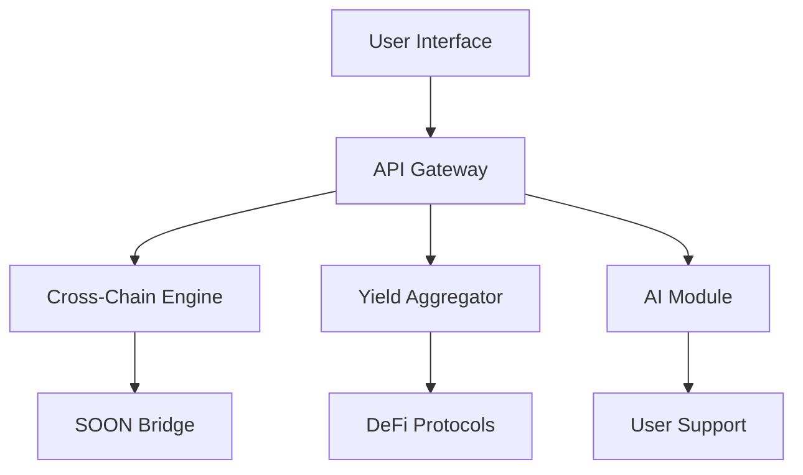

# GreyMatter 🧠

The intelligent cross-chain DeFi operations platform that makes complex blockchain interactions simple and efficient.


[](https://opensource.org/licenses/MIT)
[](https://discord.gg/greymatter)
[](https://twitter.com/greymatter)

## 📚 Table of Contents

- [Overview](#overview)
- [Features](#features)
- [Architecture](#architecture)
- [Getting Started](#getting-started)
- [Smart Contracts](#smart-contracts)
- [Security](#security)
- [Community & Support](#community--support)
- [Contributing](#contributing)
- [License](#license)

## 🌟 Overview

GreyMatter is revolutionizing the DeFi experience by combining the power of cross-chain operations, yield optimization, and artificial intelligence. Our platform serves as a unified gateway to the fragmented world of blockchain networks, making DeFi accessible to everyone.

### Vision
To create a borderless DeFi ecosystem where users can seamlessly interact with multiple blockchain networks without understanding the underlying complexity.

### Core Values
- **Security First**: Rigorous security measures and audits
- **User Empowerment**: Educational resources and AI guidance
- **Transparency**: Open-source code and clear documentation
- **Innovation**: Cutting-edge DeFi solutions and AI integration

## 🚀 Features

### Cross-Chain Bridge & Swap Engine
- **Supported Networks**:
  - Ethereum (Mainnet)
  - BNB Chain
  - Polygon
  - Avalanche
  - Solana
  - Arbitrum
  - Optimism
  - Base
  - zkSync Era

- **Bridge Features**:
  - SOON-powered secure message passing
  - Automated bridging path optimization
  - MEV protection
  - Bridge aggregation for best rates
  - Gas fee optimization
  - Transaction tracking across chains

### Advanced Yield Aggregator
- **Yield Sources**:
  - Lending protocols (Aave, Compound, etc.)
  - Liquidity pools (Uniswap, Curve, etc.)
  - Staking platforms
  - Farming incentives
  - Options writing yields

- **Yield Features**:
  - Real-time APY tracking
  - Risk scoring system (1-10 scale)
  - Impermanent loss calculator
  - Auto-compounding strategies
  - Yield history analytics
  - Gas-cost vs. yield analysis

### AI Assistant (GreyMind)
- **Natural Language Processing**:
  - Multi-language support
  - Context-aware responses
  - Transaction explanation
  - Risk assessment

- **Features**:
  - Step-by-step tutorials
  - Market analysis
  - Risk warnings
  - Gas optimization tips
  - Protocol recommendations
  - Educational content

## 🏗 Architecture

### System Components



### Technical Stack

- **Frontend**:
  - React.js with TypeScript
  - TailwindCSS
  - Ethers.js/Web3.js
  - Redux for state management
  - Web3Modal for wallet connections

- **Backend**:
  - Node.js
  - Express.js
  - Prisma
  - Redis for caching
    

- **Smart Contracts**:
  - Solidity v0.8.x
  - Hardhat development environment
  - OpenZeppelin contracts
  - Custom bridge adaptors

## 🚦 Getting Started

### Prerequisites
- Node.js v16+
- Git
- MetaMask or compatible Web3 wallet
- Yarn package manager

### Local Development Setup

```bash
# Clone the repository
git clone https://github.com/saksham-tomer/greymatter.git

# Install dependencies
cd greymatter
yarn install

# Setup environment variables
cp .env.example .env.local

# Run local development server
yarn dev

# Run tests
yarn test

# Build for production
yarn build
```

### Environment Variables

```env
# Required
DATABASE_URL
GOOGLE_CLIENT_ID
GOOGLE_CLIENT_SECRET
GOOGLE_API_KEY


```

## 🔐 Smart Contracts

### Core Contracts

1. **Bridge Controller**
   - Address: `0x...` (Ethereum Mainnet)
   - Features:
     - Cross-chain message passing
     - Token locking/unlocking
     - Fee management
     - Emergency controls

2. **Yield Router**
   - Address: `0x...` (Ethereum Mainnet)
   - Features:
     - Strategy deployment
     - Yield optimization
     - Fee distribution
     - Rewards management


## 🛡 Security

### Security Measures
- Multi-signature requirement for admin functions
- Time-locked upgrades
- Emergency pause functionality
- Rate limiting
- Slippage protection
- Regular security assessments


## 🤝 Community & Support

### Official Channels
- Email: sakshamtomerdevs@gmail.com
- Discord: [Join our community](https://discord.gg/greymatter)
- Twitter: [@GreyMatter](https://twitter.com/greymatterfi)

### Documentation
- [Technical Docs](https://github.com/saksham-tomer/greymatter/README.md)
- [Knowledge Base](https://help.greymatter.fi)

## 👥 Contributing

We welcome contributions from the community! Please see our [Contributing Guidelines](CONTRIBUTING.md) for more information.

### Development Process
1. Fork the repository
2. Create a feature branch
3. Commit changes
4. Submit a pull request
5. Pass CI/CD checks
6. Get review approval

### Code Style
- ESLint configuration
- Prettier formatting
- TypeScript strict mode
- Conventional commits

## 📜 License

GreyMatter is released under the MIT License. See the [LICENSE](LICENSE) file for more details.


---

